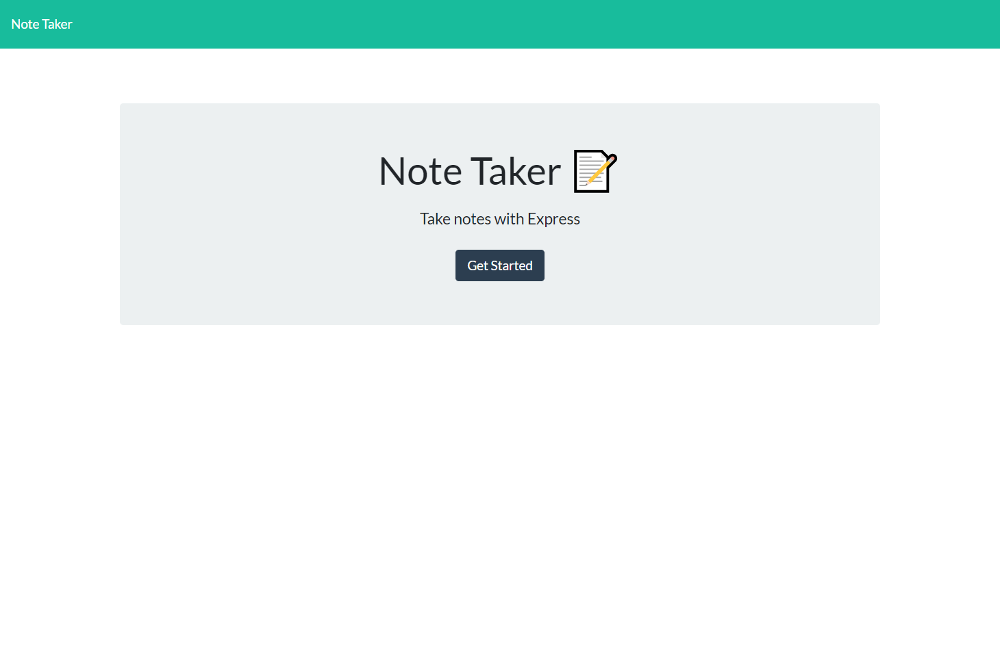

# Note Taker: Challenge 11 Assignment

  ## License
   
  Mozilla Public License 2.0 (MPL-2.0)
    Further resources on Mozilla Public License 2.0 (MPL-2.0) - Please click on the license badge above for more information.

  ## Description
  An application that can be used to write and save notes.
  

  ## Table of Contents
  - [Installation](#installation)
  - [Usage](#usage)
  - [License](#license)
  - [Contributing](#contributing)
  - [Tests](#tests)
  - [Questions](#questions)
  
  ## Installation
  N/A
  
  ## Usage
  Follow this <a href="https://note-taker-ezaiger.herokuapp.com/">link</a> for a live deployment of the application. 
  - To use this application, click on the 'Get Started' button.
  - On the /notes page, click on 'Note Title' and enter your title. Then, click on 'Note Text' and enter your text. 
  - In the upper right, click the 'Save' icon (floppy disk) to save your note
  - To delete your note, click the 'Delete' icon (garbage can) to delete your note

  ## Contributing
  Starter code provided by Xander Rapstine and John McCambridge with coding-boot-camp. Refactored code provided by ezaiger.

  ## Tests
  N/A

  ## Questions
  <a href="https://github.com/ezaiger">My GitHub Profile</a> 
  If you have additional questions, you can reach me via <a href="mailto:elisabeth.zaiger@gmail.com">email</a>